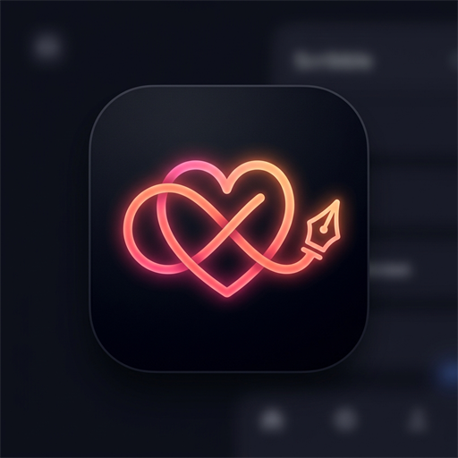

<div align="center">

  

  # Scribble 🎨

  **Real-time handwritten doodles, sketches, and notes delivered directly to your partner's Android lock screen and home screen widget.**

  [](https://github.com/Mrbunny159/Scribble.git)
  [](https://flutter.dev)
  [](https://dart.dev)
  [-3DDC84?style=for-the-badge&logo=android&logoColor=white)](https://developer.android.com)
  [](https://supabase.com)
  [](https://firebase.google.com)
  [](#)

</div>

---

## 📑 Table of Contents

- [Overview](#-overview)
- [Key Features](#-key-features)
  - [1. Real-Time Lock Screen Wallpaper Sync](#1-real-time-lock-screen-wallpaper-sync)
  - [2. Interactive Android Home Screen Widget](#2-interactive-android-home-screen-widget)
  - [3. Canvas Drawing Studio](#3-canvas-drawing-studio)
  - [4. Seamless Pairing & Connection Hub](#4-seamless-pairing--connection-hub)
  - [5. Cross-Platform Web App & Lock Screen Simulator](#5-cross-platform-web-app--lock-screen-simulator)
  - [6. Dual-Backend Architecture (Supabase & Firebase)](#6-dual-backend-architecture-supabase--firebase)
  - [7. Cloudinary High-Speed CDN Pipeline](#7-cloudinary-high-speed-cdn-pipeline)
  - [8. Google Play Store & Android 15 Compliance](#8-google-play-store--android-15-compliance)
- [System Architecture](#-system-architecture)
- [Directory Structure](#-directory-structure)
- [Prerequisites](#-prerequisites)
- [Getting Started](#-getting-started)
  - [Step 1: Clone the Repository](#step-1-clone-the-repository)
  - [Step 2: Install Flutter Dependencies](#step-2-install-flutter-dependencies)
  - [Step 3: Supabase Backend Setup](#step-3-supabase-backend-setup)
  - [Step 4: Firebase Configuration](#step-4-firebase-configuration)
  - [Step 5: Cloudinary Setup (Optional CDN)](#step-5-cloudinary-setup-optional-cdn)
  - [Step 6: Configure App Credentials](#step-6-configure-app-credentials)
- [Running the Application](#-running-the-application)
- [Building for Production](#-building-for-production)
- [Android Native Permissions & Background Services](#-android-native-permissions--background-services)
- [Security & Repository Safety](#-security--repository-safety)
- [Copyright & Proprietary Notice](#-copyright--proprietary-notice)

---

## 💡 Overview

**Scribble** bridges the distance between loved ones, partners, and close friends by turning your phone's lock screen into a shared live digital canvas. Whenever you draw a doodle, jot a quick note, or sketch something fun, your drawing instantly illuminates on your recipient's Android lock screen and home screen widget in real-time.

Built with a unified **Flutter** frontend, high-performance native **Android Kotlin** services, and scalable cloud synchronization via **Supabase** and **Firebase**, Scribble delivers smooth 60fps drawing physics, instant push notifications, and lock-screen rendering while respecting Android 15 battery and security regulations.

---

## ✨ Key Features

### 1. Real-Time Lock Screen Wallpaper Sync
* **Native WallpaperManager Integration**: Directly updates the lock screen via Android native `WallpaperManager.FLAG_LOCK` without disturbing your recipient's custom home screen wallpaper.
* **Smart Compositor & Resolution Adaptation**: Automatically queries the hardware display resolution, scaling and centering the scribble canvas while leaving dedicated padding for the system status bar, digital clock, and notifications.
* **Instant Auto-Clear**: Erasing or clearing the canvas on your side automatically restores the recipient's default wallpaper or clean state.
* **Toggleable Lock Screen Permission**: Built-in in-app toggle allows recipients to enable or pause lock screen updates anytime.

### 2. Interactive Android Home Screen Widget
* **Custom AppWidgetProvider (`ScribbleWidgetProvider`)**: Place a dedicated 4x3 or scalable widget on your Android launcher.
* **Live Scribble Rendering**: Displays the latest scribble from your active partner with the partner's display name and timestamp.
* **1-Tap Quick Action**: Tap the widget to immediately launch the Scribble Canvas Studio and reply with a fresh doodle.
* **Manual Refresh Button**: Force re-sync with backend servers on demand directly from the home screen.

### 3. Canvas Drawing Studio
* **Smooth Quadratic Bézier Curve Ink**: Custom gesture recognizer and path compositor for silky-smooth, lag-free pen strokes.
* **Variable Stroke Widths**: Select between `2px` (fine pen), `4px` (regular marker), `8px` (brush), and `14px` (bold highlighter).
* **Rich HSL & Preset Color Palette**: Dynamic color selector with high-contrast neon, pastel, and vibrant hues.
* **Eraser Tool**: Precision pixel and stroke eraser to touch up intricate drawings.
* **Undo & Redo Stack**: Multi-level state history allowing you to easily step backwards or forwards through your edits.
* **Draggable Text Insertion**: Overlay custom handwritten-style text stickers anywhere on the canvas.
* **Clear Canvas with Safety Confirmation**: Accidental clearing protection with animated confirmation dialogs.
* **Local Gallery Export**: Save your artwork directly to the device's photo gallery with full transparency preservation.

### 4. Seamless Pairing & Connection Hub
* **Instant 6-Character Pairing Code**: Generate a secure, unique alphanumeric connection code with a single tap.
* **Clipboard Copy & Share**: Share pairing codes through your favorite messaging apps with 1-tap clipboard copying.
* **Multi-Partner Support**: Connect with multiple friends, partners, or family members.
* **Active Connection Switcher**: Seamlessly switch your active drawing target from the top-level app bar.
* **Multi-Scribble Slider**: Browse through received scribbles in an interactive carousel on the main dashboard.

### 5. Cross-Platform Web App & Lock Screen Simulator
* **Full Desktop & Mobile Web Experience**: Access the complete canvas, pairing hub, and profile manager in any modern web browser.
* **Interactive Android Lock Screen Simulator**: Web users can preview their drawings inside an interactive, photorealistic Android smartphone frame to see exactly how their scribble looks on their partner's phone lock screen!

### 6. Dual-Backend Architecture (Supabase & Firebase)
* **Supabase Integration**:
  - PostgreSQL database with Row Level Security (RLS) policies.
  - Realtime publication channels (`supabase_realtime`) for sub-second socket updates.
  - Supabase Storage buckets for avatar uploads and canvas snapshots.
* **Firebase Integration**:
  - Firebase Authentication with email/password and guest sign-in.
  - Cloud Firestore real-time snapshot listeners.
  - Firebase Cloud Messaging (FCM) background handler for waking up sleeping devices to render new lock screen art.
  - Firebase Hosting configuration included out-of-the-box.

### 7. Cloudinary High-Speed CDN Pipeline
* **Unsigned CDN Uploads**: Ultra-fast media compression and image delivery powered by Cloudinary's worldwide CDN.
* **Zero Secret Exposure**: Client uploads utilize unsigned upload presets, ensuring no API secrets are bundled into client APKs or web builds.
* **Graceful Fallback**: Automatically falls back to Supabase/Firebase storage if custom Cloudinary credentials are not configured.

### 8. Google Play Store & Android 15 Compliance
* **Android 15 Ready**: Configured for `targetSdk = 35` and `compileSdk = 35`.
* **Android Photo Picker**: Implements modern system photo picker (`image_picker`), removing invasive legacy storage permissions (`READ_EXTERNAL_STORAGE`).
* **Foreground Service Justification**: Complies with strict Play Store foreground service policies using `FOREGROUND_SERVICE_DATA_SYNC` with explicit rationale.
* **Full Account Deletion Lifecycle**: Complete in-app account deletion flow plus an external web portal (`web/privacy.html`) to satisfy Google Play Data Safety policies.
* Comprehensive review guide available in [PLAY_STORE_GUIDELINES.md](PLAY_STORE_GUIDELINES.md).

---

## 🏗️ System Architecture

```
                               ┌────────────────────────────────┐
                               │   Scribble Client Application   │
                               │        (Flutter Engine)        │
                               └───────────────┬────────────────┘
                                               │
                       ┌───────────────────────┴───────────────────────┐
                       ▼                                               ▼
     ┌──────────────────────────────────┐            ┌──────────────────────────────────┐
     │      Flutter UI & Canvas         │            │    Native Android (Kotlin)       │
     ├──────────────────────────────────┤            ├──────────────────────────────────┤
     │ • Bézier Curve Drawing Engine    │            │ • MainActivity (MethodChannel)   │
     │ • MultiScribbleSlider            │            │ • WallpaperManager (FLAG_LOCK)   │
     │ • Auth & Pairing Screens         │            │ • ScribbleWidgetProvider         │
     │ • Web Lockscreen Simulator       │            │ • ScribbleSyncService (DataSync) │
     │ • Theme & Responsive Layout      │            │ • BootReceiver & AlarmReceiver   │
     └─────────────────┬────────────────┘            └─────────────────┬────────────────┘
                       │                                               │
                       └───────────────────────┬───────────────────────┘
                                               │
                        ┌──────────────────────┴──────────────────────┐
                        ▼                                             ▼
       ┌─────────────────────────────────┐           ┌─────────────────────────────────┐
       │        Supabase Cloud           │           │         Firebase Suite          │
       ├─────────────────────────────────┤           ├─────────────────────────────────┤
       │ • PostgreSQL (RLS Enforced)     │           │ • Firebase Authentication       │
       │ • Realtime WebSocket Channels   │           │ • Cloud Firestore Realtime Sync │
       │ • Public Storage Buckets        │           │ • Cloud Messaging (FCM Push)    │
       │   (`avatars`, `scribbles`)      │           │ • Firebase Web Hosting          │
       └────────────────┬────────────────┘           └────────────────┬────────────────┘
                        │                                             │
                        └──────────────────────┬──────────────────────┘
                                               ▼
                               ┌────────────────────────────────┐
                               │      Cloudinary CDN (Media)    │
                               │  • Unsigned fast image uploads │
                               │  • Dynamic edge image caching  │
                               └────────────────────────────────┘
```

---

## 📁 Directory Structure

```
Scribble/
├── .github/                       # GitHub actions & workflows
├── android/                       # Native Android project (Kotlin / Gradle)
│   ├── app/
│   │   ├── build.gradle.kts       # Android app configuration (targetSdk 35)
│   │   ├── google-services.json   # Firebase Android client credentials
│   │   └── src/main/
│   │       ├── AndroidManifest.xml# Permissions & service declarations
│   │       ├── kotlin/.../
│   │       │   ├── BootReceiver.kt            # Re-registers alarms on device reboot
│   │       │   ├── LockscreenOverlayActivity.kt# Lock screen display overlay
│   │       │   ├── MainActivity.kt            # Flutter MethodChannel bridge
│   │       │   ├── ScribbleAlarmReceiver.kt   # Scheduled background sync triggers
│   │       │   ├── ScribbleSyncService.kt     # Foreground data synchronization
│   │       │   └── ScribbleWidgetProvider.kt  # Android home screen AppWidget
│   │       └── res/                           # Layouts, widget XML, mipmap icons
│   └── build.gradle.kts           # Root Android Gradle configuration
├── assets/
│   └── images/
│       └── app_logo.png           # Neon gradient infinity-pen brand icon
├── ios/                           # Native iOS Runner project
├── lib/                           # Core Flutter Application Code
│   ├── core/
│   │   ├── constants.dart         # Backend endpoints & storage keys
│   │   └── theme.dart             # Dark/light theme palettes & typography
│   ├── models/
│   │   ├── connection_model.dart  # Pairing connection data models
│   │   ├── scribble_model.dart    # Drawing stroke & metadata models
│   │   └── user_profile.dart      # User account profile representations
│   ├── screens/
│   │   ├── auth/                  # Authentication & onboarding
│   │   ├── canvas/                # Drawing studio & color picker dialog
│   │   ├── home/                  # Main hub, active partner switcher & slider
│   │   ├── legal/                 # In-app privacy policy & terms
│   │   ├── pairing/               # 6-character pairing code management
│   │   ├── profile/               # Avatar upload & account deletion
│   │   └── setup/                 # First-run Supabase configuration UI
│   ├── services/
│   │   ├── cloudinary_service.dart# Unsigned media upload handling
│   │   ├── firebase_service.dart  # Firestore sync, Auth & account cleanup
│   │   ├── image_save_service.dart# Local storage & gallery exporter
│   │   ├── native_lockscreen_service.dart # Flutter-to-Kotlin MethodChannel
│   │   └── supabase_service.dart  # Supabase client, tables & realtime channels
│   ├── widgets/
│   │   └── scribble_logo.dart     # Responsive vector/image branding components
│   ├── firebase_options.dart      # FlutterFire auto-generated configuration
│   └── main.dart                  # Application entry point & FCM router
├── public/                        # Firebase Hosting static web assets
│   └── index.html                 # Web portal entry point
├── web/                           # Flutter Web entry point & assets
│   ├── index.html                 # HTML container
│   ├── manifest.json              # Progressive Web App (PWA) manifest
│   └── privacy.html               # Public Privacy Policy & Deletion Portal
├── .gitignore                     # Git ignore rules for public repository safety
├── analysis_options.yaml          # Dart analyzer & linter rules
├── firebase.json                  # Firebase CLI configuration
├── firestore.indexes.json         # Firestore composite index definitions
├── firestore.rules                # Firestore security rules
├── PLAY_STORE_GUIDELINES.md       # Google Play Store review & compliance guide
├── pubspec.yaml                   # Flutter package dependencies & assets
└── supabase_schema.sql            # Supabase PostgreSQL schema, RLS & publications
```

---

## 🛠️ Prerequisites

Before you begin, ensure you have the following installed on your machine:

- **[Flutter SDK](https://docs.flutter.dev/get-started/install)** (`^3.13.4` or higher)
- **[Dart SDK](https://dart.dev/get-dart)** (bundled with Flutter)
- **[Android Studio](https://developer.android.com/studio)** with:
  - Android SDK Platform 35 (Android 15)
  - Android SDK Command-line Tools
  - Android SDK Build-Tools 35.x
- **[Java Development Kit (JDK 17)](https://www.oracle.com/java/technologies/downloads/#java17)**
- **[Git](https://git-scm.com/)**
- A physical Android device or Android Virtual Device (AVD) running Android 8.0 (API 26) or higher.

---

## 🚀 Getting Started

### Step 1: Clone the Repository

```bash
git clone https://github.com/Mrbunny159/Scribble.git
cd Scribble
```

### Step 2: Install Flutter Dependencies

Fetch all required packages declared in `pubspec.yaml`:

```bash
flutter pub get
```

---

### Step 3: Supabase Backend Setup

Scribble uses Supabase for Postgres storage, user profiles, and real-time canvas updates.

1. Create a free account and new project at [supabase.com](https://supabase.com).
2. Open the **SQL Editor** in your Supabase Project Dashboard.
3. Open [`supabase_schema.sql`](supabase_schema.sql) in this repository, copy the entire SQL script, and click **Run**.
   - This sets up the `profiles`, `pairing_codes`, `connections`, and `scribbles` tables.
   - It automatically enables **Row Level Security (RLS)** policies.
   - It registers tables to the `supabase_realtime` publication for instant synchronization.
   - It creates two public storage buckets: `avatars` and `scribbles`.
4. Go to **Project Settings** -> **API** to copy your:
   - **Project URL** (e.g., `https://your-project-id.supabase.co`)
   - **anon / public Key** (e.g., `eyJhbGciOi...`)

---

### Step 4: Firebase Configuration

Scribble integrates Firebase for authentication, Firestore data archiving, and background FCM push messages:

1. Create a project at [Firebase Console](https://console.firebase.google.com).
2. Add an **Android app** with package name:
   ```text
   com.scribble.scribble
   ```
3. Download the generated `google-services.json` file and place it at:
   ```text
   android/app/google-services.json
   ```
4. Enable **Authentication** in Firebase (Email/Password & Anonymous).
5. Enable **Cloud Firestore** and deploy the included security rules:
   ```bash
   firebase deploy --only firestore:rules
   ```

---

### Step 5: Cloudinary Setup (Optional CDN)

Cloudinary provides high-speed CDN image distribution with automatic optimization:

1. Create a free account at [cloudinary.com](https://cloudinary.com/).
2. From the **Dashboard**, note your **Cloud Name** (e.g., `mycloud`).
3. Navigate to **Settings (Gear Icon)** -> **Upload** -> **Upload Presets**.
4. Click **Add Upload Preset**, set **Signing Mode** to **Unsigned**, name it (e.g., `scribble_preset`), and save.

---

### Step 6: Configure App Credentials

You can supply your credentials using either approach:

#### Method A: In-App UI Configuration (Easiest)
Simply run the app. On initial launch, Scribble presents the **Supabase Setup Screen**, allowing you to paste your URL and Anon Key directly into the running app.

#### Method B: In Code
Open [`lib/core/constants.dart`](lib/core/constants.dart) and enter your credentials:

```dart
class AppConstants {
  // Supabase Credentials
  static const String supabaseUrl = 'YOUR_SUPABASE_PROJECT_URL';
  static const String supabaseAnonKey = 'YOUR_SUPABASE_ANON_PUBLIC_KEY';

  // Cloudinary CDN Configuration
  static const String cloudinaryCloudName = 'YOUR_CLOUDINARY_CLOUD_NAME';
  static const String cloudinaryUploadPreset = 'scribble_preset';
}
```

---

## 📱 Running the Application

### Running on an Android Device / Emulator
Connect your Android phone with USB debugging enabled, or start an emulator:

```bash
flutter run
```

### Running on Web
Test the web canvas and lock screen simulator directly in Google Chrome:

```bash
flutter run -d chrome
```

### Running on Windows Desktop
```bash
flutter run -d windows
```

---

## 📦 Building for Production

### Android Release APK
Generate an optimized standalone APK for side-loading or testing:

```bash
flutter build apk --release
```
*Output location:* `build/app/outputs/flutter-apk/app-release.apk`

### Android App Bundle (`.aab`) for Google Play Store
Generate an unsigned or signed App Bundle for the Google Play Developer Console:

```bash
flutter build appbundle --release
```
*Output location:* `build/app/outputs/bundle/release/app-release.aab`

For step-by-step keystore creation, signing configuration, and Google Play Console questionnaire responses, refer to [PLAY_STORE_GUIDELINES.md](PLAY_STORE_GUIDELINES.md).

### Web Release Build & Firebase Hosting
```bash
# Build optimized web bundle
flutter build web --release

# Deploy to Firebase Hosting
firebase deploy --only hosting
```

---

## 🔒 Android Native Permissions & Background Services

Scribble requests only the minimum set of permissions necessary to function:

| Permission | Purpose |
| :--- | :--- |
| `android.permission.INTERNET` | Communication with Supabase, Firebase, and Cloudinary APIs. |
| `android.permission.ACCESS_NETWORK_STATE` | Real-time connectivity monitoring to pause sync when offline. |
| `android.permission.SET_WALLPAPER` | Setting the received scribble image onto the Android lock screen (`WallpaperManager.FLAG_LOCK`). |
| `android.permission.POST_NOTIFICATIONS` | Delivering doodle alerts and foreground sync indicators on Android 13+ (API 33+). |
| `android.permission.FOREGROUND_SERVICE` | Executing reliable lock screen image downloading in the background. |
| `android.permission.FOREGROUND_SERVICE_DATA_SYNC` | Explicit Android 14/15 foreground service type for data and lockscreen synchronization. |
| `android.permission.RECEIVE_BOOT_COMPLETED` | Restores widget update alarms and lockscreen sync listeners when the device reboots. |
| `android.permission.WAKE_LOCK` | Briefly powers the CPU to process new scribble push events. |

> **Note on Storage:** Scribble does **not** request broad `READ_EXTERNAL_STORAGE` or `MANAGE_EXTERNAL_STORAGE` permissions. It strictly utilizes the privacy-preserving native **Android Photo Picker** (`image_picker`).

---

## 🛡️ Google Play Store Policy Compliance

Scribble is architected from the ground up to comply with the latest Google Play Developer policies:

- ✅ **In-App Account Deletion**: Users can permanently purge their account and all associated drawings directly from `ProfileScreen`.
- ✅ **Web Account Deletion Portal**: Google Play requires an external web deletion link for users who uninstalled the app. This is implemented in [`web/privacy.html`](web/privacy.html) (Section 6).
- ✅ **In-App Privacy Policy**: Readily accessible prior to registration and from the settings screen.
- ✅ **Target API Level**: Built and tested against `targetSdk = 35` (Android 15).
- Detailed submission answers and questionnaire forms are documented in [PLAY_STORE_GUIDELINES.md](PLAY_STORE_GUIDELINES.md).

---

## 🔐 Security & Repository Safety

When cloning or deploying this repository:

1. **Environment Variables & Secrets**: All `.env`, keystores (`*.jks`, `*.keystore`), and `key.properties` are blocked by [.gitignore](.gitignore).
2. **Client Keys**: Supabase `anon` public keys and Cloudinary `unsigned` upload presets are specifically designed for safe client-side consumption when backed by Row-Level Security (RLS). Never commit service role or admin secret keys.
3. **Row-Level Security**: Ensure you execute [`supabase_schema.sql`](supabase_schema.sql) in your database so all tables are protected by PostgreSQL RLS.

---

## 🔒 Copyright & Proprietary Notice

**Copyright © 2026 Mrbunny159 / Scribble. All Rights Reserved.**

This repository, software, visual branding, design systems, and source code are **strictly proprietary**. 
- **No Open Source License Granted**: This project is **not** open source. You do not have permission to copy, modify, distribute, publish, sublicense, sell, reverse engineer, or create derivative works from any part of this software or its assets without explicit prior written authorization from the owner.
- **Personal Reference Only**: The repository is published for demonstration and portfolio display purposes only.

---

<div align="center">
  <sub>Built with ❤️ using Flutter, Kotlin, Supabase, and Firebase.</sub><br>
  <sub>Official Repository: <a href="https://github.com/Mrbunny159/Scribble.git">https://github.com/Mrbunny159/Scribble.git</a></sub>
</div>